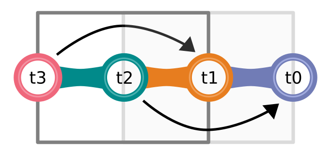

<div align="center">



# Snapshot Interpolation

## A Snapshot Interpolation library for Real-Time Multiplayer Games

#### Easily add Snapshot Interpolation (also called Entity Interpolation or Buffer Interpolation) to your Games.

[](https://www.npmjs.com/package/@geckos.io/snapshot-interpolation)
[](https://github.com/geckosio/snapshot-interpolation/actions?query=workflow%3ACI)
[](https://github.com/geckosio/snapshot-interpolation/commits/master)
[](https://www.npmjs.com/package/@geckos.io/snapshot-interpolation)
[](https://codecov.io/gh/geckosio/snapshot-interpolation)
[](https://www.typescriptlang.org/)

</div>

---

## About

The Interpolation Buffer is by default 3 server frames long (Interpolation between 4 Snapshots).
So if the **latency is 50ms** and one **server frame is 50ms**, the Interpolation Buffer would be 200ms long.

If you are interested to learn a bit more about Snapshot Interpolation, watch [this video](https://youtu.be/Z9X4lysFr64?t=800).

## Features

- Easily add **Client-Side Prediction** and **Server Reconciliation**.
- Easily add **Lag Compensation**.
- Easily **compress/encode** your snapshots before sending/receiving.

## Introduction

Take a look at these YouTube videos:

- [Short Version](https://youtu.be/-9ix6JxpqGo)
- [Long Version](https://youtu.be/ciNR4t-5-WI)

## Game Example

The [github repository](https://github.com/geckosio/snapshot-interpolation) contains a nice example. Take a look!

```bash
# clone the repo
$ git clone https://github.com/geckosio/snapshot-interpolation.git

# cd into it
$ cd snapshot-interpolation

# install all dependencies
$ npm install

# start the example
$ npm start

# play in your browser
http://localhost:8080/
```

## Install

Install from npm.

```console
npm install @geckos.io/snapshot-interpolation
```

Or use the bundled version.

```html
<script src="https://unpkg.com/@geckos.io/snapshot-interpolation@1.0.1/bundle/snapshot-interpolation.js"></script>
<script>
  const { SnapshotInterpolation, Vault } = Snap
</script>
```

## How to use

### server.js

```js
// import @geckos.io/snapshot-interpolation
import { SnapshotInterpolation } from '@geckos.io/snapshot-interpolation'

// initialize the library
const SI = new SnapshotInterpolation()

// your server update loop
update() {
  // create a snapshot of the current world
  const snapshot = SI.snapshot.create(worldState)

  // add the snapshot to the vault in case you want to access it later (optional)
  SI.vault.add(snapshot)

  // send the snapshot to the client (using geckos.io or any other library)
  this.emit('update', snapshot)
}
```

### client.js

```js
// import @geckos.io/snapshot-interpolation
import { SnapshotInterpolation } from '@geckos.io/snapshot-interpolation'

// initialize the library (add your server's fps)
const SI = new SnapshotInterpolation(serverFPS)

// when receiving the snapshot on the client
this.on('update', (snapshot) => {
  // read the snapshot
  SI.snapshot.add(snapshot)
}

// your client update loop
update() {
  // calculate the interpolation for the parameters x and y and return the snapshot
  const snapshot = SI.calcInterpolation('x y') // [deep: string] as optional second parameter

  // access your state
  const { state } = snapshot

  // apply the interpolated values to you game objects
  const { id, x, y } = state[0]
  if (hero.id === id) {
    hero.x = x
    hero.y = y
  }
}
```

## World State

The World State has to be an Array with non nested Objects (except for Quaternions). You can name you keys as you want. For degree, radian or quaternion values add `key(deg)`, `key(rad)` or `key(quat)`.

### Linear Interpolation

```js
// the worldState on the server
const worldState = [
  { id: 'heroBlue', x: 23, y: 14, z: 47 },
  { id: 'heroRed', x: 23, y: 14, z: 47 },
  { id: 'heroGreen', x: 23, y: 14, z: 47 }
]

// calc interpolation on the client
SI.calcInterpolation('x y z')
```

### Degrees, Radians and Quaternions

```js
// the worldState on the server
const worldState = [
  {
    id: 'myHero',
    direction: Math.PI / 2,
    rotationInDeg: 90,
    q: { x: 0, y: 0.707, z: 0, w: 0.707 }
  }
]

// calc interpolation on the client
SI.calcInterpolation('direction(rad) rotationInDeg(deg) q(quat)')
```

## Multiple States

```js
// the players state
const playersState = [
  { id: 0, x: 65, y: -17 },
  { id: 1, x: 32, y: 9 }
]

// the towers state
const towersState = [
  { id: 0, health: 100, type: 'blizzardCannon' },
  { id: 1, health: 89, type: 'flameThrower' }
]

const worldState = {
  players: playersState,
  towers: towersState
}

// create snapshot
SI.snapshot.create(worldState)

// we only want to interpolate x and y on the players object
SI.calcInterpolation('x y', 'players')
```

## Vault

The Vault holds and secures all your Snapshots. Each SnapshotInterpolation instance holds one Vault, but you can easily create more if you need:

```js
import { Vault } from '@geckos.io/snapshot-interpolation'

const customVault = new Vault()
```

## Compression

You can use the package [@geckos.io/typed-array-buffer-schema](https://www.npmjs.com/package/@geckos.io/typed-array-buffer-schema) to compress your snapshots before sending them to the client.

```js
// schema.js
const playerSchema = BufferSchema.schema('player', {
  id: uint8,
  x: { type: int16, digits: 1 },
  y: { type: int16, digits: 1 }
})

const snapshotSchema = BufferSchema.schema('snapshot', {
  id: { type: string8, length: 6 },
  time: uint64,
  state: { players: [playerSchema] }
})

export const snapshotModel = new Model(snapshotSchema)

// server.js
const snapshot = SI.snapshot.create({
  players: [
    { id: 0, x: 17.5, y: -1.1 },
    { id: 1, x: 5.8, y: 18.9 }
  ]
})

const buffer = snapshotModel.toBuffer(snapshot)
send(buffer)

// client.js
receive(buffer => {
  snapshot = snapshotModel.fromBuffer(buffer)
  SI.addSnapshot(snapshot)
})
```

## API

This looks very TypeScriptisch, but you can of course use it in JavaScript as well.

```ts
// import
import { SnapshotInterpolation, Vault, Types } from '@geckos.io/snapshot-interpolation'

// types
type Value = number | string | Quat | undefined
type ID = string
type Time = number
type State = Entity[]
type Quat = { x: number; y: number; z: number; w: number }

// interfaces
export interface Entity {
  id: string
  [key: string]: Value
}
export interface Snapshot {
  id: ID
  time: Time
  state: State | { [key: string]: State }
}
export interface InterpolatedSnapshot {
  state: State
  percentage: number
  older: ID
  newer: ID
}

// static methods
/** Create a new Snapshot */
SnapshotInterpolation.CreateSnapshot(state: State): Snapshot

/** Create a new ID */
SnapshotInterpolation.NewId(): string

/** Get the current time in milliseconds. */
SnapshotInterpolation.Now(): number

// class SnapshotInterpolation
const SI = new SnapshotInterpolation(serverFPS?: number)

/** Access the vault. */
SI.vault: Vault

/** Get the Interpolation Buffer time in milliseconds. */
SI.interpolationBuffer.get(): number

/** Set the Interpolation Buffer time in milliseconds. */
SI.interpolationBuffer.set(milliseconds: number): void

/** Create the snapshot on the server. */
SI.snapshot.create(state: State): Snapshot

/** Add the snapshot you received from the server to automatically calculate the interpolation with calcInterpolation() */
SI.snapshot.add(snapshot: Snapshot): void

/** Interpolate between two snapshots give the percentage or time. */
SI.interpolate(snapshotA: Snapshot, snapshotB: Snapshot, timeOrPercentage: number, parameters: string, deep: string): InterpolatedSnapshot

/** Get the calculated interpolation on the client. */
SI.calcInterpolation(parameters: string, deep: string): InterpolatedSnapshot | undefined

// class Vault
const vault = new Vault()

/** Get a Snapshot by its ID. */
vault.getById(id: ID): Snapshot

/** Get the latest snapshot */
vault.get(): Snapshot | undefined;

/** Get the two snapshots around a specific time */
vault.get(time: number): { older: Snapshot; newer: Snapshot; } | undefined

/** Get the closest snapshot to e specific time */
vault.get(time: number, closest: boolean): Snapshot | undefined

/** Add a snapshot to the vault. */
vault.add(snapshot: Snapshot): void

/** Get the current capacity (size) of the vault. */
vault.size(): number

/** Set the max capacity (size) of the vault. */
vault.setMaxSize(size: number): void

/** Get the max capacity (size) of the vault. */
vault.getMaxSize(): number

```
